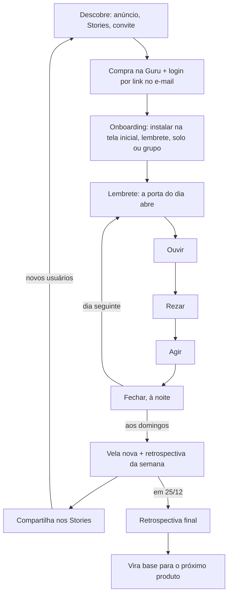

# Guia do Advento · Escopo do Produto

Exportado do documento de escopo em 8/10/2026.

## 1. Visão e promessa

O Guia do Advento é um mini app de 26 dias que leva o jovem adulto católico a viver o Advento com profundidade e chegar ao "melhor Natal da vida". Cada dia leva de 7 a 10 minutos e tem estrutura fixa: ouvir um santo, rezar, agir.

- **Promessa:** a melhor preparação para o Natal da sua vida.
- **Objetivo de produto:** que o usuário complete os 26 dias. Conclusão é a métrica que importa, não tempo de tela.
- **Objetivo de negócio:** produto low ticket fora do Cateclub. Serve de porta de entrada para formar uma base católica própria e validar outras ofertas.
- **Princípio:** conteúdo de peso (santos, Escritura, liturgia) com a experiência dos melhores apps seculares (Duolingo, Instagram, Spotify).

## 2. Público e posicionamento

O público é o jovem adulto católico, por volta dos 22 anos em diante: já trabalha, vive no celular e quer viver a fé com mais constância. Não é produto infantil nem de educação dos filhos, para não competir com o Cateclub.

| Referência | O que levamos dela |
| --- | --- |
| Duolingo | Sequência diária (streak) com tolerância, progresso visível, hábito curto |
| Instagram | Leitura em formato stories, compartilhamento nativo |
| Spotify | Wrapped: retrospectiva pessoal feita para compartilhar |
| Hallow | Áudio de oração guiada com qualidade de produção |

**Diferencial:** profundidade (santos e liturgia, não autoajuda cristã), experiência de app premium e funcionar sozinho ou em grupo.

## 3. Estrutura da jornada

A jornada vai de 29/11 (1º domingo do Advento) a 24/12 (véspera de Natal): 26 dias em quatro semanas, a última com apenas 5 dias.

| Período | O que acontece |
| --- | --- |
| 29/11 a 5/12 | 1ª semana (7 dias). Domingo 29/11 acende a 1ª vela (roxa) |
| 6 a 12/12 | 2ª semana. Domingo 6/12: 2ª vela (roxa) + retrospectiva da 1ª semana |
| 8/12 | Imaculada Conceição: conteúdo mariano próprio |
| 13 a 19/12 | 3ª semana, Domingo da Alegria. 13/12: 3ª vela (rosa) + retrospectiva da 2ª semana |
| 17 a 23/12 | Antífonas do Ó, uma antífona por dia |
| 20 a 24/12 | 4ª semana, só 5 dias. 20/12: 4ª vela (roxa) + retrospectiva da 3ª semana |
| 25/12, manhã | Retrospectiva final da jornada |

Os domingos marcam o ritmo: vela nova na coroa, santo convidado e retrospectiva da semana. A 3ª semana começa no Domingo da Alegria (vela rosa). De 17 a 23/12, cada dia traz a reflexão de uma das Antífonas do Ó.

## 4. Ritual diário

Todo dia tem as mesmas quatro etapas, nesta ordem. O dia conta como completo quando Ouvir, Rezar e Agir estão feitos. Fechar é o fecho da noite e alimenta as retrospectivas.

| Etapa | O que é | Formato | Tempo (meta proposta) |
| --- | --- | --- | --- |
| Ouvir | Trecho fiel do santo ou da Escritura + explicação atual | Telas em formato stories, com áudio narrado por voz jovem | 2–3 min |
| Rezar | Oração guiada a partir do texto do dia | Áudio com player e silêncio guiado | 3–5 min |
| Agir | Uma missão concreta para o dia, ligada ao texto | Cartão com a missão + botão "cumpri" | Ao longo do dia |
| Fechar | Check da noite: cumpriu a missão? Que frase ficou? | 2 ou 3 toques, sem digitar | 30 s |

- A porta do dia só abre no dia certo. Dias perdidos ficam disponíveis para recuperar. No plano Simples, Ouvir e Rezar são em texto, sem áudio.
- A frase marcada no Fechar vira a "frase que mais te marcou" na retrospectiva.

## 5. Conteúdo e fontes

Santo Afonso de Ligório é a espinha da jornada: suas meditações de Advento e Natal estão em domínio público e cobrem o período inteiro. Outras vozes entram em pontos fixos.

| Bloco | Fonte | Quando |
| --- | --- | --- |
| Dias comuns | Santo Afonso de Ligório | Segunda a sábado |
| Domingos | Santo Afonso abre a jornada; depois Santo Agostinho, São Bernardo e São John Henry Newman (ordem a definir) | 4 domingos |
| Antífonas do Ó | Liturgia das Horas: reflexão sobre a antífona do dia | 17 a 23/12 |
| Véspera de Natal | Fechamento da jornada | 24/12 |

Exceção na grade: em 8/12, solenidade da Imaculada Conceição, o dia tem conteúdo mariano próprio no lugar do texto de Santo Afonso.

**Regras de produção**

- Cada texto = trecho fiel e curto do santo + explicação atual. Tom de referência: Frei Gilson. Espiritualmente profundo, ligado ao dia a dia, leve, mas nunca informal: sem gíria, sem piada, frases simples falando direto com o leitor.
- Tradução própria a partir do original em italiano, para não depender de traduções modernas com direitos.
- Voz sintética de timbre jovem lê textos, orações e antífonas. Cada áudio é revisado por uma pessoa (pronúncia, ritmo e pausas).
- Revisão de um padre ou teólogo antes de publicar.
- Volume mínimo: 26 textos, 26 orações em áudio, 26 missões.

**Produção em levas semanais.** Cada semana (textos, missões, áudios e revisão) fica pronta antes de começar. Recomendação: semanas 1 e 2 prontas antes de 29/11, para sempre ter uma semana de folga. Com isso, um atraso não chega ao usuário.

## 6. Gamificação e progresso

A gamificação é máxima, mas toda interna: o usuário compete só consigo mesmo. Não existe ranking entre pessoas.

| Mecânica | Como funciona |
| --- | --- |
| Coroa do Advento | Ilustração central da tela inicial. Cada domingo acende uma vela nova (5 versões da arte, de 0 a 4 velas acesas) |
| Portas | Cada dia é uma porta que abre na data certa, como um calendário do Advento |
| Sequência (streak) | Dias seguidos com o ritual completo. Tem tolerância: perder um dia não zera tudo |
| Caminho da semana | Os 7 dias da semana com os concluídos marcados e o de hoje em destaque |
| Progresso do dia | Três barras no topo: Ouvir, Rezar, Agir |
| Contadores | Dias rezados, missões cumpridas, minutos em oração (alimentam as retrospectivas) |

Regra da tolerância: o dia perdido pode ser feito até o fim do dia seguinte sem quebrar a sequência.

## 7. Modo solo e modo grupo

O app precisa funcionar muito bem para quem está sozinho, e melhor ainda em grupo. O grupo é uma camada opcional por cima da jornada individual, nunca um requisito. Ele faz parte do plano Completo.

**Solo:** jornada completa, sequência, coroa pessoal e retrospectivas. Nada fica bloqueado por falta de grupo.

**Grupo (amigos, família, paróquia):**

- Alguém cria o grupo e convida por link.
- Todos fazem o mesmo dia, cada um no seu ritmo durante o dia.
- A coroa do grupo só acende quando todos completam o dia. O incentivo é cuidar do outro, não competir.
- A tela inicial mostra quem já rezou hoje ("4 de 5 já rezaram hoje").
- Sem ranking, sem pontuação comparativa.

## 8. Retrospectivas

Toda semana o usuário recebe uma retrospectiva no estilo Wrapped, feita para compartilhar nos Stories. É o principal motor de divulgação orgânica durante o período de vendas.

| Retrospectiva | Quando | Conteúdo |
| --- | --- | --- |
| Semanal | Domingos 6, 13 e 20/12 | Dias rezados (ex.: 7/7), missões cumpridas, minutos em oração, a frase que mais marcou, vela da semana |
| Final | Manhã de 25/12 | A jornada inteira: 26 dias, sequência máxima, coroa completa, frases favoritas, um convite para o Natal |

- Cada retrospectiva gera uma arte vertical (9:16) pronta para Stories, com a marca do app e um link de download.
- Em grupo, há também uma versão coletiva ("nosso grupo acendeu a coroa 6 de 7 dias").

## 9. Fluxo de uso ponta a ponta

O usuário entra uma vez e repete o mesmo ritual por 26 dias. Os domingos quebram a rotina com vela nova e retrospectiva, e o compartilhamento traz gente nova.

1. **Entrada:** vê um anúncio, os Stories de um amigo ou recebe um convite de grupo, compra e faz login.
2. **Onboarding:** escolhe o horário do lembrete e se vai sozinho ou em grupo (pode entrar num grupo depois).
3. **Dia típico:** notificação, Início, "Abrir a porta de hoje", Ouvir, Rezar e recebe a missão. À noite, Fechar.
4. **Domingo:** a coroa acende uma vela nova e a retrospectiva da semana fica pronta para compartilhar.
5. **Final:** o último dia é 24/12 e a retrospectiva da jornada inteira chega na manhã de 25/12. O que vem depois ainda está em aberto.

### Antes de 29/11: compra antecipada

Quem compra antes do Advento entra num modo de espera, que trabalha para a venda em vez de deixar o app vazio.

| Elemento | O que faz | Plano |
| --- | --- | --- |
| Contagem regressiva | "Faltam 19 dias para acender a primeira vela", com a coroa apagada | Todos |
| Setup antecipado | Horário do lembrete, instalação na tela inicial, notificações | Todos |
| Criar ou entrar num grupo | O grupo já se forma antes de começar | Completo |
| Convite compartilhável | Arte 9:16 para Stories e WhatsApp ("Vou viver o Advento com o Guia. Vem comigo?") com link de compra | Todos |
| Upgrade | Mostra o que o Completo tem a mais (áudio e grupo) e leva ao checkout da diferença | Simples |

**Upgrade dentro do app (plano Simples):** o conteúdo do Completo aparece bloqueado com cadeado, nunca escondido.

- No Ouvir e no Rezar, um player com uma prévia de alguns segundos e o botão "Ouvir no Completo".
- A aba Grupo mostra como a coroa do grupo funciona e oferece o upgrade.
- As retrospectivas lembram o que o áudio teria somado ("48 min em oração guiada no Completo").
- O upgrade custa a diferença (R$ 27) e vale a qualquer momento, inclusive durante o Advento.

## 10. Mapa de telas e navegação

A navegação tem quatro abas fixas na barra inferior: Início, Caminho, Grupo e Você. O ritual do dia abre em tela cheia a partir do Início.

Antes de 29/11, o Início vira a tela de espera (seção 9). Para quem está no Simples, o upgrade aparece no Ouvir, no Rezar, na aba Grupo e nas retrospectivas.

| Tela | Função | Status |
| --- | --- | --- |
| Onboarding | Boas-vindas, como funciona, instalar na tela inicial, horário do lembrete, solo ou grupo | A desenhar |
| Início | Saudação, coroa, sequência, grupo, caminho da semana, botão "Abrir a porta de hoje" | Desenhada |
| O Dia · Ouvir | Texto do santo em stories, com obra de arte e áudio | Desenhada |
| O Dia · Rezar | Player da oração guiada | Parcial (player na tela do Dia) |
| O Dia · Agir | Missão do dia e confirmação | A desenhar |
| Fechar | Check da noite | A desenhar |
| Antífonas do Ó | Variação do Dia para 17 a 23/12, com a antífona do dia | A desenhar |
| Caminho | As 26 portas da jornada, recuperar dias perdidos | A desenhar |
| Grupo | Membros, coroa do grupo, convite | A desenhar |
| Você | Perfil, lembretes, modo Noite ou Pergaminho, conta | A desenhar |
| Retrospectiva semanal | Wrapped da semana + compartilhar | Desenhada |
| Retrospectiva final | Wrapped da jornada inteira | A desenhar |

## 11. Notificações (proposta, a validar)

As notificações são a principal alavanca de conclusão, mas no máximo duas por dia, para não virar ruído.

| Gatilho | Quando | Mensagem (ideia) |
| --- | --- | --- |
| Porta do dia | Horário escolhido no onboarding | "A porta de hoje está aberta" |
| Fechar | Noite, só se o dia foi aberto | "Como foi a missão de hoje?" |
| Sequência em risco | Noite, só se o dia não foi feito | Substitui o lembrete do Fechar |
| Grupo | Quando falta só você | "Só falta você para acender a coroa" |
| Domingo | Manhã | Vela nova acesa + retrospectiva pronta |

## 12. Identidade visual

O visual segue o sistema Vitral Litúrgico Contemporâneo: a riqueza fica dentro das ilustrações e a interface é quieta, com fundos lisos, cartões simples e pouco dourado. Está aplicado nas 6 telas desenhadas.

| Elemento | Definição |
| --- | --- |
| Modos | Noite (ameixa escuro, #1B1224) e Pergaminho (creme, #F7EEDC) |
| Tipografia | Fraunces (serifada forte) nos títulos; DM Sans nos textos |
| Cor de destaque | Dourado âmbar (#E1B65A no Noite, #8A5E1A no Pergaminho), com moderação; rosa Gaudete (#D792AA / #96476A) na 3ª semana |
| Botões principais | Violeta litúrgico chapado (#74508B no Noite, #553070 no Pergaminho) |
| Superfícies | Cartões lisos com borda fina; desfoque só na barra de navegação |
| Imagens | Ilustrações vetoriais em estilo vitral: coroa, releituras das pinturas, santos e ícone |

O guia completo do estilo está no repositório do app (docs/vitral-style-guide.md). Regra central: a interface nunca compete com a ilustração.

### Inventário de artes

| Arte | Quantidade | Onde aparece | Observação |
| --- | --- | --- | --- |
| Coroa do Advento | 5 versões (0 a 4 velas acesas) | Espera, Início, retrospectivas | A versão apagada é da contagem regressiva. Ordem: roxa, roxa, rosa no 3º domingo, roxa. Fundo transparente, funciona nos dois modos |
| Releituras de pinturas | 26, uma por dia | Ouvir | Releituras em vitral de obras em domínio público, com crédito "a partir de" artista e obra. Inclui uma pintura mariana para 8/12 |
| Retratos dos santos | 4: Afonso, Agostinho, Bernardo, Newman | Cabeçalho do Dia | Hoje o cabeçalho usa só as iniciais "SA" |
| Natividade | 1 | Retrospectiva final, 25/12 | Fecho da jornada |
| Modelos de Stories 9:16 | 4: semanal, final, grupo, convite | Compartilhamento | Design com dados preenchidos pelo app, não ilustração |
| Ícone e tela de abertura | 1 de cada | Tela inicial do celular | Aparece quando instalam o web app |

## 13. Modelo de negócio e distribuição

Decidido: é um produto low ticket do nicho católico, fora do Cateclub, com espaço para order bump e upsell. A janela de venda é curta e fixa: quem não entrar até 29/11 já começa atrasado.

| Item | Situação |
| --- | --- |
| Preço | Simples, R$ 20: textos, missões, coroa, sequência e retrospectivas. Completo, R$ 47: tudo isso + áudios narrados, orações guiadas e modo grupo |
| Plataforma | Web app instalável (decidido) |
| Compra e acesso | Checkout na Guru. O webhook cria a conta com o plano comprado e o login é por link mágico no e-mail, sem senha |
| Order bump e upsell | Order bumps: licença família ou grupo e guia de confissão do Advento. Upsell em aberto |
| Aquisição paga | Anúncios na Meta, com teste de criativos antes de 29/11 |
| Aquisição orgânica | Retrospectivas compartilhadas nos Stories, convites de grupo, paróquias |
| Depois de 24/12 | Vira base: captura o contato (WhatsApp ou e-mail) e recebe a oferta do próximo produto |

## 14. Métricas de sucesso

A métrica principal é a conclusão: quantos compradores chegam ao dia 26. As outras explicam por que ela sobe ou cai. As metas serão definidas depois do primeiro teste.

| Métrica | Como medir | Por que importa |
| --- | --- | --- |
| Conclusão da jornada | % dos compradores que completam os 26 dias | Prova que a promessa foi cumprida |
| Conclusão da semana 1 | % que completa os primeiros 7 dias | Sinal precoce: dá tempo de corrigir |
| Ativação | % que instala na tela inicial e ativa as notificações | Sem isso, o lembrete não chega |
| Upgrade | % do Simples que passa para o Completo | Receita e valor percebido do áudio |
| Compartilhamento | % que compartilha uma retrospectiva ou convite | Motor de divulgação orgânica |
| Vendas por indicação | Vendas vindas de links de convite e retrospectivas | Quanto o orgânico paga do tráfego |
| Grupos | % de compradores do Completo em um grupo | Valida a aposta no modo grupo |
| Order bumps | Taxa de aceitação de cada bump | Ticket médio |

## 15. Fora do escopo da v1

Para chegar a 29/11 com qualidade, estes itens ficam de fora:

- Ranking ou qualquer comparação entre pessoas (decisão de produto, não só de prazo).
- Personalização por diagnóstico ou quiz inicial.
- Conteúdo infantil ou de educação dos filhos (território do Cateclub).
- Feed, chat ou comentários dentro do grupo.
- Diário com texto livre.
- Outros tempos litúrgicos (Quaresma etc.), que podem reaproveitar a mesma estrutura depois.

## 16. Decisões em aberto e riscos

Faltam 54 dias até 29/11. Quase tudo está decidido. Ficam em aberto a data de início das vendas, quem revisa a doutrina e se haverá upsell além dos order bumps.

| Bloco | Decisão | Por que importa |
| --- | --- | --- |
| 1 · Produto | Decidido: web app instalável | Define prazo, custo e se há revisão de loja |
| 1 · Produto | Decidido: termina em 24/12, com a retrospectiva final na manhã de 25/12 | Muda calendário, conteúdo e retrospectiva final |
| 1 · Produto | Decidido: quem compra depois de 29/11 começa no dia corrente e pode recuperar os dias perdidos | Afeta vendas tardias e a lógica das portas |
| 2 · Negócio | Decidido: Simples a R$ 20 (sem áudio e sem grupo) e Completo a R$ 47 | Base de toda a oferta |
| 2 · Negócio | Decidido: order bumps de licença família ou grupo e guia de confissão do Advento | O que é vendido junto e depois |
| 2 · Negócio | Decidido: depois do Advento, o usuário vira base para o próximo produto | Retenção da base e próximo produto |
| 3 · Conteúdo | Decidido: domingos com Afonso, Agostinho, Bernardo e Newman | Fecha a grade dos 26 dias |
| 3 · Conteúdo | Decidido: tom de referência é Frei Gilson | Destrava a escrita das explicações |
| 3 · Conteúdo | Decidido: voz sintética revisada. Em aberto: quem revisa a doutrina | Gargalo de produção de áudio |
| 4 · Detalhes | Decidido: o dia perdido pode ser recuperado até o fim do dia seguinte | Equilíbrio entre motivação e frustração |
| 4 · Detalhes | Decidido: a Imaculada (8/12) ganha conteúdo próprio; Guadalupe (12/12) não | Conteúdo próprio ou não |
| 4 · Detalhes | Decidido: o grupo tem retrospectiva coletiva | Mais divulgação, mais trabalho |

**Riscos**

- **Prazo:** com produção em levas, o que precisa estar pronto em 29/11 é o app, os anúncios e as semanas 1 e 2. O risco passa a ser perder a folga durante o Advento: se uma leva atrasar, não há como adiar a liturgia.
- **Notificação no iPhone:** no web app, só funciona depois de instalar na tela inicial. O onboarding precisa conduzir essa instalação, senão o lembrete diário não chega.
- **Direitos:** confirmar que as traduções próprias de Santo Afonso estão livres.
- **Doutrina:** sem revisão de um padre ou teólogo, um erro vira crise de reputação.
- **Janela curta:** se a venda começar tarde, não há segunda chance até o próximo ano.
- **Voz sintética:** pode soar artificial justamente na oração, que é o coração do plano de R$ 47. Testar 3 áudios com 5 pessoas do público antes de produzir os cerca de 60.
